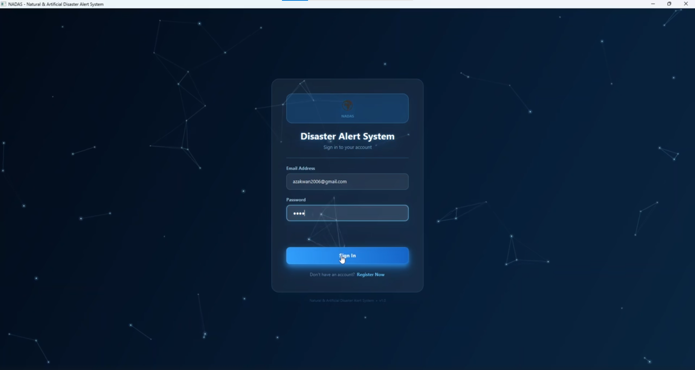
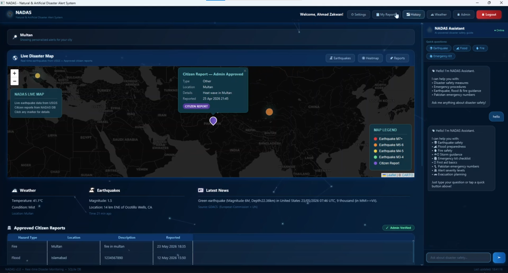
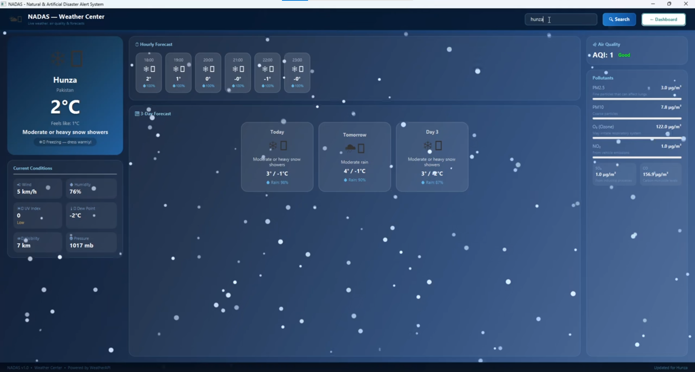
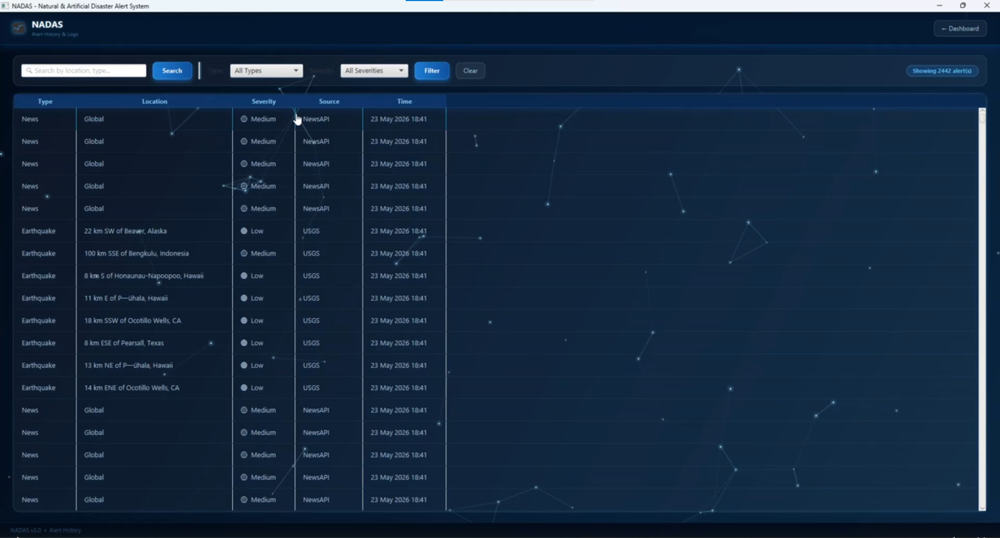
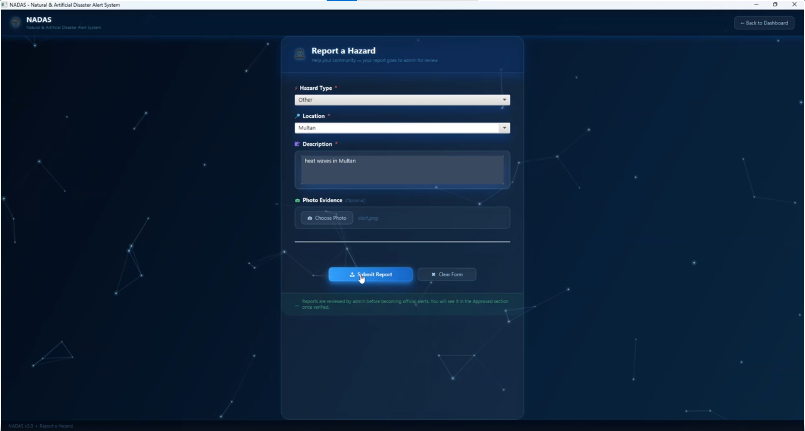
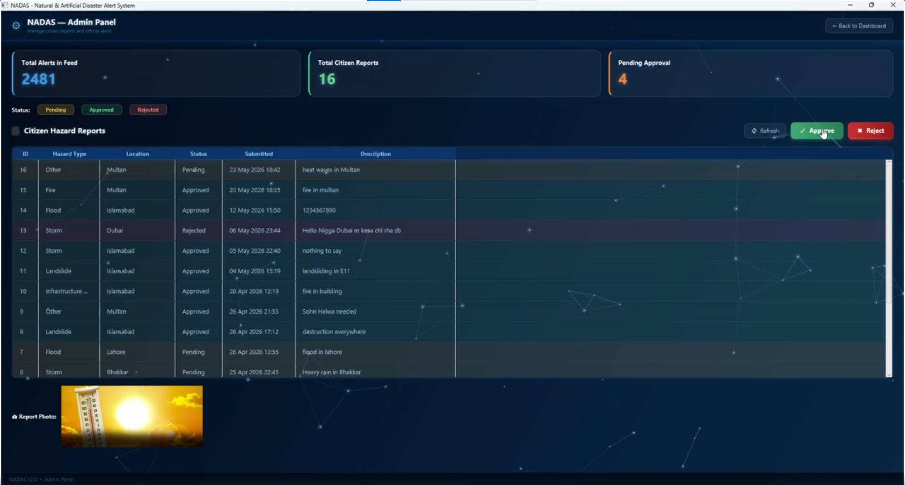
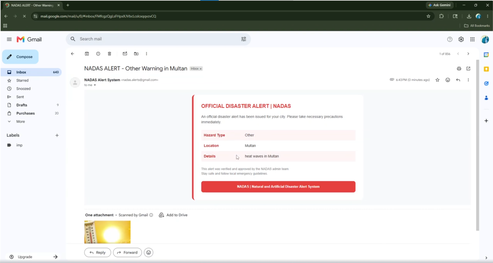

# NADAS – Natural & Artificial Disaster Alert System 🚨

NADAS is a real-time desktop application developed for monitoring, reporting, and responding to natural and artificial disasters across Pakistan.

Developed as a Software Design & Architecture (CS-3004) semester project at FAST-NUCES Islamabad.

---

## Features

### 🌍 Real-Time Disaster Monitoring

- Earthquake heatmap integration using USGS API
- Live weather monitoring
- Real-time UN disaster news feed using GDACS

### 👥 Citizen Reporting System

- Users can report hazards and disasters
- Admin approval workflow for submitted reports
- Report tracking and management system

### 📧 Automated Alerts

- Email notifications to users in affected cities
- Real-time alert dissemination system

### 🔐 Secure Admin Portal

- Role-based authentication and authorization
- Admin dashboard for managing reports and alerts

### 🤖 AI-Powered Chatbot

- Disaster-specific safety guidance
- Real-time assistance for emergency situations

### 📜 Alert History

- Search and filter functionality
- Historical disaster tracking

---

## Technologies Used

- Java 21
- JavaFX
- SQLite
- Maven
- Jakarta Mail
- Leaflet.js

---

## Software Design Concepts

### Design Patterns Applied

- MVC Architecture
- Singleton Pattern
- Factory Pattern
- Observer Pattern
- Repository Pattern

### Principles Used

- GRASP Principles
- Modular Design
- Separation of Concerns

---

## Screenshots

### Login Screen



### Dashboard + Chatbot



### Weather Center



### Alert History



### Settings


### Report Hazard



### Approve Hazard



### Receive Email



---

## Project Structure

```text
src/
 └── main/
     ├── java/
     └── resources/
```

---

## How to Run

### Clone Repository

```bash
git clone https://github.com/FaizanHaider313/nadas-disaster-alert-system.git
```

### Open Project

Open the project using IntelliJ IDEA or any Java IDE with Maven support.

### Run Application

```bash
mvn clean javafx:run
```

---

## Team Members

- Syed Faizan Haider
- Hadi Sajjad
- Ahmad Zakwan

---

## Academic Context

This project was developed for the Software Design & Architecture course at FAST-NUCES Islamabad.

---

## License

This project is intended for educational purposes only.
